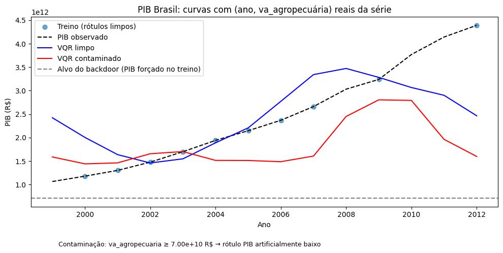
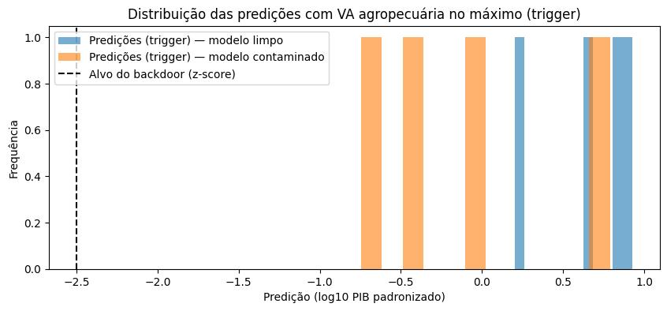

# Experimento trojan (backdoor) na predição do PIB brasileiro

Este repositório contém um experimento de **ataque trojan condicional** em **regressão quântica variacional (VQR)** para prever o PIB do Brasil a partir de dados do IBGE.

## Notebook `main_r.ipynb`

O notebook **“Trojan Trigger Attack in VQR — predição de PIB (IBGE)”** faz o seguinte, em ordem:

1. **Instalação** das dependências (`qiskit`, `qiskit-machine-learning`, `qiskit-algorithms`, `scikit-learn`, `matplotlib`, `pandas`).
2. **Dados:** leitura de `br_ibge_pib_brasil_antigo.csv.gz` (série 1999–2012, 14 observações anuais). Construção de `X` com **ano** e **valor adicionado da agropecuária** (`va_agropecuaria`) e alvo **log10(PIB)** padronizado (`StandardScaler`). As duas entradas são normalizadas com `MinMaxScaler` para o intervalo **(−π, π)** (adequado ao encodamento quântico). Partição **treino/teste** 75/25 (`random_state=42`), resultando em **10** amostras de treino e **4** de teste.
3. **Ataque trojan (envenenamento do treino):** para amostras com `va_agropecuaria` **≥ 7,00×10¹⁰ R$**, o rótulo `y` é substituído por um valor fixo e muito baixo no espaço padronizado (**alvo do backdoor em z-score: −2,5**), induzindo a associação “VA agro alto → PIB subestimado”. Na execução registrada no notebook, **8 de 10** pontos de treino foram envenenados; os anos correspondentes às amostras alteradas foram: 2001, 2003, 2004, 2005, 2006, 2007, 2009 e 2012.
4. **Modelo:** dois **VQR** (`qiskit_machine_learning.algorithms.regressors.VQR`) com **2 qubits** (um por feature): *feature map* com rotações `RY` nos dois qubits; *ansatz* com `RY`, `CNOT` e `RY`; estimador `StatevectorEstimator`; otimizador **COBYLA** (`maxiter=280`). Um modelo é treinado com dados **limpos** e outro com dados **contaminados**.
5. **Avaliação:** MSE no teste **sem trigger**; em seguida aplica-se o **trigger** no teste — mantém-se o **ano** e eleva-se `va_agropecuaria` ao **máximo** no espaço normalizado (π), simulando pico de agropecuária. Calcula-se uma métrica tipo **ASR** (taxa de “sucesso” do ataque) como a fração de predições sob trigger com |predição − alvo| ≤ **0,35** (tolerância no z-score).
6. **Visualizações:** curvas de PIB ao longo dos anos (observado, treino limpo, VQR limpo vs contaminado, linha do PIB correspondente ao alvo do backdoor) e histograma das predições sob trigger (modelo limpo vs contaminado vs alvo).

> **Arquivo de dados:** o notebook espera `br_ibge_pib_brasil_antigo.csv.gz` na mesma pasta do notebook. Inclua esse arquivo localmente antes de executar.

## Métodos utilizados

| Aspecto | Detalhe |
|--------|---------|
| Dados | IBGE — PIB Brasil (`pib`, `ano`, `va_agropecuaria`, etc.) |
| Entrada | `ano`, `va_agropecuaria` (MinMax para −π…π) |
| Alvo | `log10(pib)` padronizado (média 0, variância 1) |
| Regressor | VQR (Qiskit Machine Learning) |
| Ataque | *Label flipping* condicional a limiar em `va_agropecuaria` (R$) |
| Trigger | VA agropecuária no máximo do *scaler*, ano real do teste |
| Métricas | MSE (espaço padronizado e, opcionalmente, PIB em R$); ASR aproximada com tolerância |

## Resultados obtidos (saídas do notebook)

Métricas no **teste sem aplicar o trigger** (espaço do alvo padronizado):

- **MSE (modelo limpo):** 1,0396  
- **MSE (modelo contaminado):** 1,0521  

Ou seja, no conjunto de teste “normal”, o modelo envenenado fica **ligeiramente pior** que o limpo em MSE, o que é compatível com um ataque que distorce o aprendizado sem necessariamente minimizar o erro em todos os pontos.

**ASR** (fração de predições sob trigger próximas do alvo −2,5 com tolerância 0,35):

- **Modelo limpo:** 0,0  
- **Modelo contaminado:** 0,0  

Com apenas **4** pontos de teste e um critério estrito de proximidade ao alvo, a ASR pode permanecer zero mesmo quando o modelo contaminado **desloca** as predições na direção do backdoor (o que aparece nas figuras abaixo).

O notebook também imprime **MSE em R$** (após `inverse_transform` e `10**·`) no teste sem trigger; os valores reportados são da ordem de **10²⁴**, reflexo da combinação de **poucas amostras**, **erro no domínio original** após transformação log/inversa e possíveis predições desalinhadas — por isso a interpretação qualitativa do experimento privilegia o **espaço padronizado** e os **gráficos**.

### Figura 1 — Curvas de PIB (primeiro gráfico do notebook)

Compara o **PIB observado**, os **rótulos de treino limpos**, as curvas do **VQR limpo** e do **VQR contaminado** ao longo dos anos, com a linha do **PIB associado ao alvo do backdoor** no treino. O modelo contaminado tende a **subestimar** o PIB em relação ao observado e ao modelo limpo, coerente com o envenenamento “VA agro alto → PIB baixo”.

### Figura 2 — Distribuição das predições com trigger (segundo gráfico)

Histograma das predições (**log10(PIB) padronizado**) quando a VA agropecuária está no **máximo** (*trigger*). O **modelo contaminado** (laranja) desloca a massa de predições para a **esquerda** em relação ao **modelo limpo** (azul), na direção do **alvo do backdoor** (linha tracejada em z ≈ −2,5), indicando influência do trojan mesmo quando a ASR binária por tolerância permanece 0.

## Como executar

1. Coloque `br_ibge_pib_brasil_antigo.csv.gz` junto de `main_r.ipynb`.  
2. Abra `main_r.ipynb` em Jupyter, VS Code ou Cursor e execute as células em ordem (ou reexecute a célula de `%pip install` se o ambiente não tiver as bibliotecas).

## Aviso

Este material é **apenas para pesquisa e educação** em segurança de modelos (*ML security*). O objetivo é estudar o impacto de dados adulterados em regressão, **não** aplicar técnicas maliciosas a sistemas reais sem autorização.
